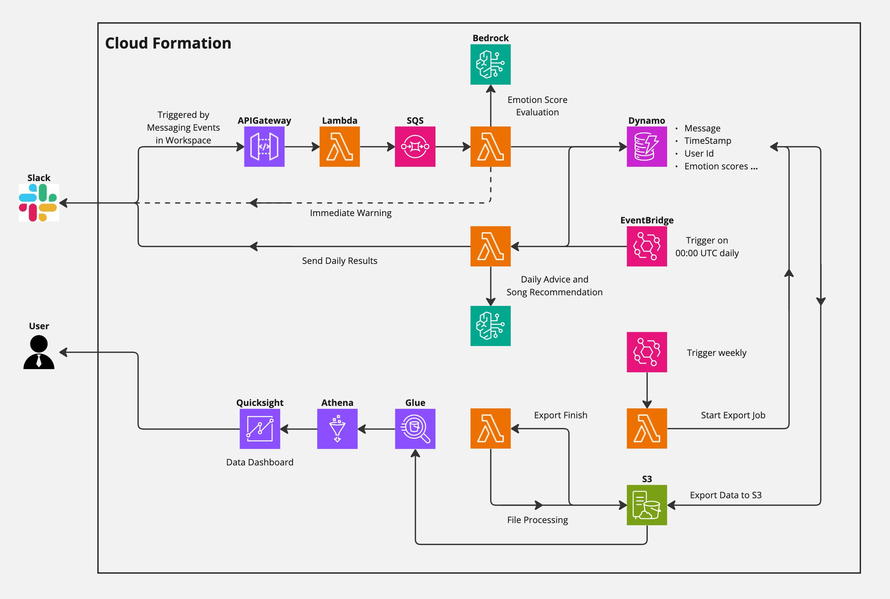
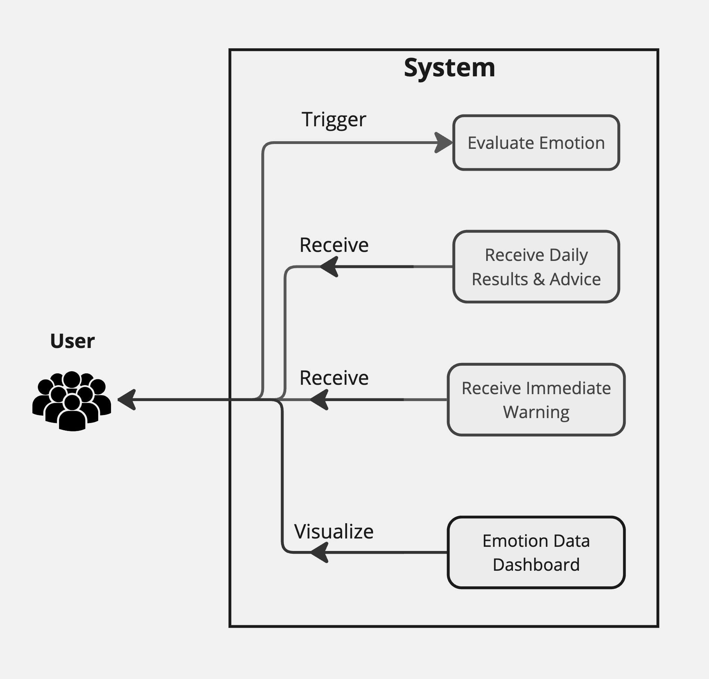

# Emotion Analyzer


## Overview
An Emotion Tracker/Analyzer powered by AWS Bedrock that analyzes the emotions (fear, anger, joy, sad, contempt, disgust, and surprise) on text messages sent to Slack workspace.
<br>
Specifically, following capabilities are included.
1. Get emotion scores (ranging from 0.0 to 1.0) for text messages sent to Slack in real time
2. If negative emotion score go beyond a specific threshold, warnings will be sent as an reply to the message immediately
3. Weekday Daily emotion report/message (sent at 9:00am JST, MON-FRI, reporting on the previous weekday, to a Slack channel you specify) for everyone who had sent messages to any of the channel in the workspace. For each person, the report includes
    - a pick up on the top negative messages if applicable,
    - a simple one-sentence advice
    - a song recommendation to start off the day
4. Dashboard for visualizing the collected data/results.


## Motivation
How people take on the emotion aspect of a message depends on many different criteria.
That can be their life experience, their current emotion, who sends the message and many more.
<br>
This project is aiming to solve the frustration in two aspects.
- The frustration of trying to guess how other people will take on the message we send.
- The frustration of having other people getting mad us due to the emotion they take on what we say, even though that might not be what we meant.

This tool will provide a uniform standard on how the emotion aspect of the text messages are perceived. Also, being able to visualize emotions with numbers and how they transform from time to time, we are able to improve the way we communicate!


## Cloud Architecture

<br>
- Database: Dynamo
- Message Event Handling
    - Handler: API Gateway + Lambda + SQS
    - Emotion Score Evaluated by Bedrock
    - Data written to Dynamo
- Daily Result
    - Handled by Lambda with EventBridge Trigger
    - Recommendations provided by Bedrock based on the scores for the text messages in the previous day
- QuickSight Visualization
    - exported from Dynamo to S3 on a weekly based
    - Query with Athena + Glue


## Use Case



## Demo
Here are couple quick demos on what this tracker/analyzer is able to do.
### Real Time Warning


### Daily Emotion Report


### Dashboard


## Set Up

### Slack Configuration (1)
1. Create a Slack App from the [Apps Console](https://api.slack.com/apps) for the workspace that you would like to track and analyze the emotion for.
2. Navigate to **Basic Information** and obtain **Verification Token**
3. Navigate to **OAuth & Permissions**
    1. Obtain the **Bot User OAuth Token**
    2. Add `chat:write` and `chat:write.public` to Bot Token Scopes
4. Create a Channel that you want to receive the daily report
5. Obtain the Channel Id

### CDK Stack
1. In `cdk.json`, set up the following environment variables. To use the default value of a specific variable, leave the corresponding key out.

```
"develop": {
    "REGION": "",
    "SLACK_VERIFICATION_TOKEN": "",
    "BOT_OAUTH_TOKEN": "",
    "RESULT_CHANNEL_ID": "",
    "CHAT_MODEL": "",
    "IMMEDIATE_WARNING_THRESHOLD": "",
    "QUICKSIGHT_USER_NAME": "",
    "QUICKSIGHT_TIMEZONE": ""
}
```
<br>

- `REGION`: the region that you want to deploy the CDK Stack to. If not specified, `CDK_DEFAULT_REGION` will be used.
- `SLACK_VERIFICATION_TOKEN`: the **Verification Token** you obtained above.
- `BOT_OAUTH_TOKEN`: the **Bot User OAuth Token** you obtained above
- `RESULT_CHANNEL_ID`: the channel id for the channel that you want to receive the daily report
- `CHAT_MODEL`: the bedrock model that you would like to use. If not specified, `anthropic.claude-3-haiku-20240307-v1:0` will be used.
- `IMMEDIATE_WARNING_THRESHOLD`: the threhold value that you would like to receive immediate warning for negative messages. Default to `0.6`.
- `QUICKSIGHT_USER_NAME`: The quicksight user name.
- `QUICKSIGHT_TIMEZONE`: The quicksight timezone to use for dashboard. Default to be `Asia/Tokyo`.

<br>

2. Deploy the stack by running `cdk deploy --context context=develop --all`. This will deploy all the resources we have in the Cloud Architecture above.
    - You might need to set up AWS CLI, register for Quicksight, install Rust and [Cargo Lambda](https://www.cargo-lambda.info) in your environment.
    - Quicksight related resources are defined separately in `EmotionVisualizerStack`. If you don't need the dashboard or don't have quicksight set up yet, you can also choose to deploy the rest of the resources only.
3. Obtain the API Gateway Endpoint URL. This should be something like `https://xxx.execute-api.us-east-1.amazonaws.com/prod/`.


### Slack Configuration (2)
1. Navigate to **Event Subscriptions** in the app settings page.
2. **Enable Events** by toggle the switch to On.
3. For **Request URL**, enter the API GAteway endpoint URL. You should see the **Verified** checkmark if success.
4. For **Subscribe to events on behalf of users**, add `message.channels`, `message.im`, and `message.mpim`. This will add the necessary OAuth scope automatically.
5. Navigate to **Installed App Settings** page and install the app to the workspace.

For more details on setting up Slack Events API, please check out my blog [here](https://medium.com/@itsuki.enjoy/trigger-lambda-from-slack-messages-with-slack-events-api-d73d80d8ae97).


### Confirm
Above is all you need to get the Emotion Tracker/Analyzer running.
<br>
To confirm we have the resources deployed with success, there are couple things we can check on.
1. Send a really dirty message (including the s-word or the f-word) to any of the Slack Channels. You should see the immediate warning coming back (depending on the threshold value you set).
2. Check out Dynamo Table items directly to confirm that the message you sent is indeed registered with the emotion score.
3. Go to Quicksight to checkout the dashboard. Since no data is send to S3 yet, the visuals should say "There was no data found for the visual".


## Possible Improvements
- Dynamo Export To S3: Use Incremental Export instead to only export the changes.
- Analyze Stress level based on the evaluated emotion scores.
- Taking Conversations into account while processing emotion scores.


## Some Blogs for Further Details
- [Sentiment/Emotion Analysis with Generative AI (JSON Mode)](https://medium.com/@itsuki.enjoy/sentiment-emotion-analysis-with-generative-ai-json-mode-cfa36fbfa988)
- [Trigger Lambda From Slack Messages with Slack Events API](https://medium.com/@itsuki.enjoy/trigger-lambda-from-slack-messages-with-slack-events-api-d73d80d8ae97)
- [AWS Glue Table from Dynamo JSON in S3 Two Ways](https://medium.com/@itsuki.enjoy/aws-glue-table-from-dynamo-json-in-s3-2-ways-960edfe85b88)
- [AWS: Create QuickSight Datasource, Dataset, Analysis and Dashboard using CDK](https://awstip.com/aws-create-quicksight-datasource-dataset-analysis-and-dashboard-using-cdk-e9c0a9f08540)
- [AWS: Create QuickSight Filters/Controls with CDK](https://medium.com/@itsuki.enjoy/aws-create-quicksight-filters-controls-with-cdk-eddb9603a1d5)
